# MyMail

A Kotlin Multiplatform Application for seamless Email and SMS messaging, using the KSend library I built which utilises SendGrid/Twilio API's.

# Platforms 

- Android 
- Ios 
- Desktop
- Web

## Android 

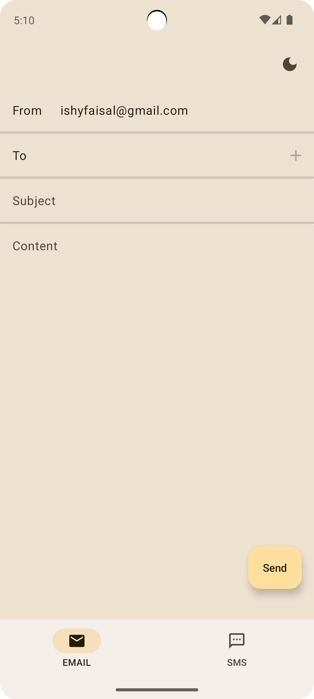

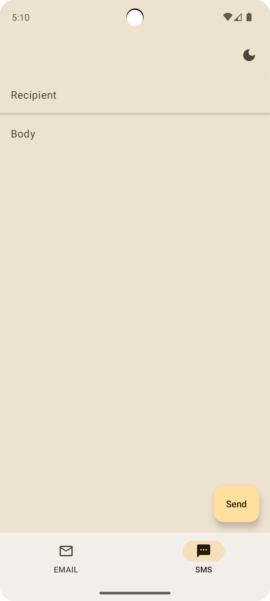
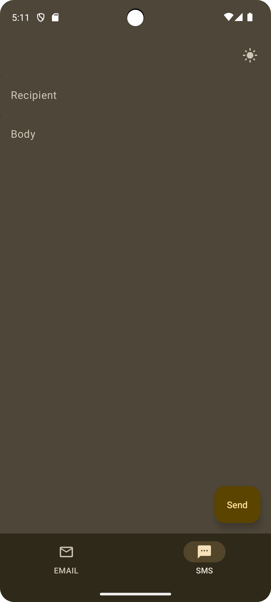

## Ios 

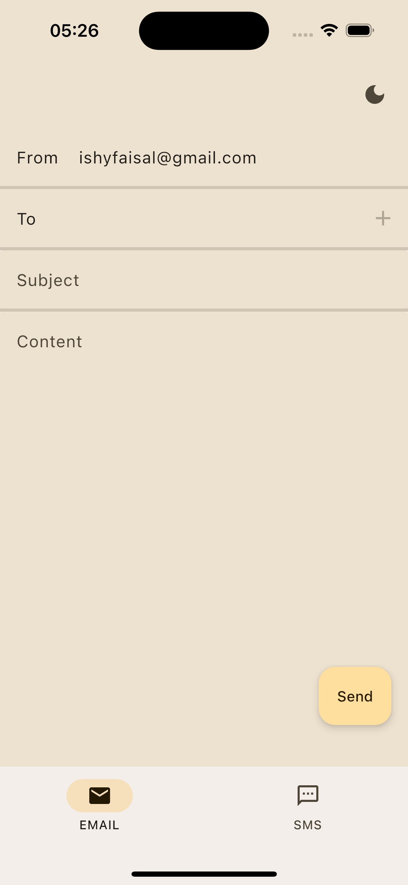
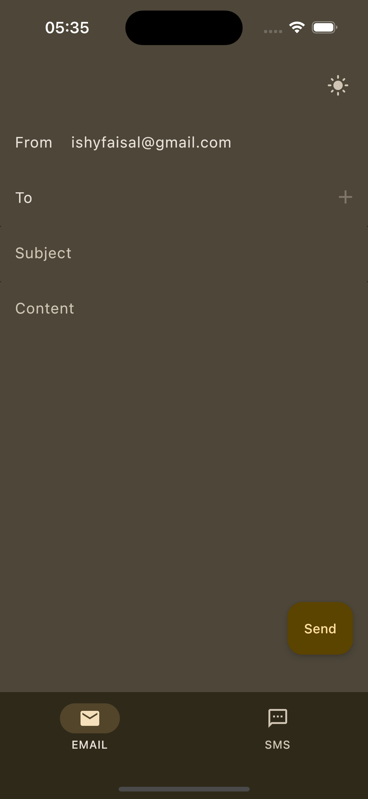
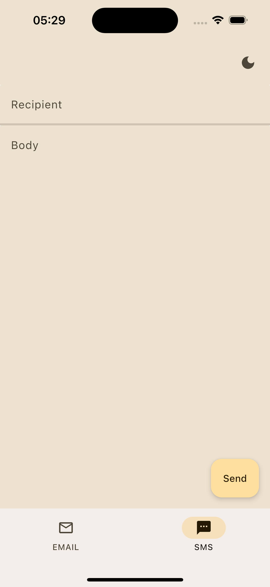
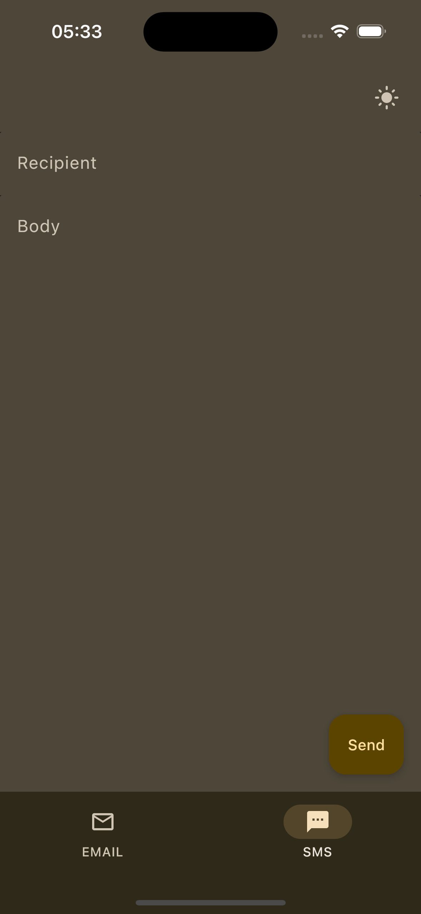

## Desktop 

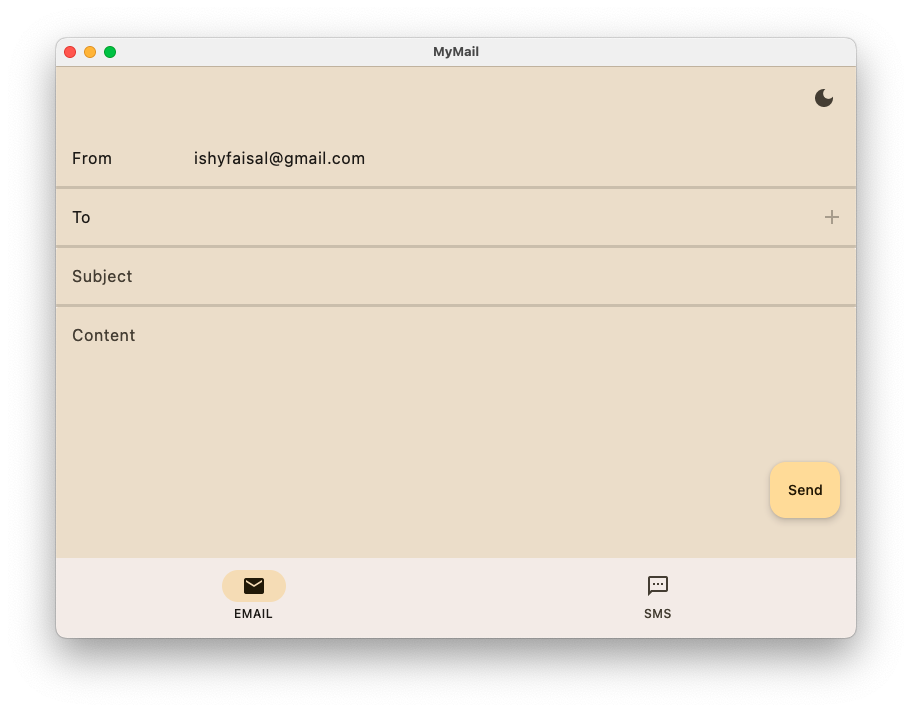
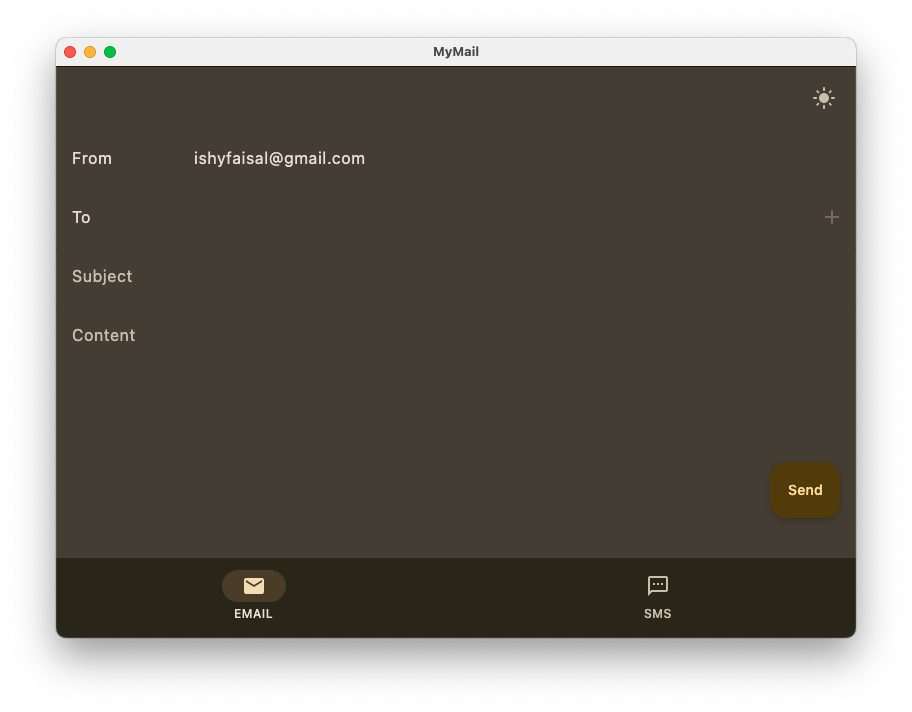
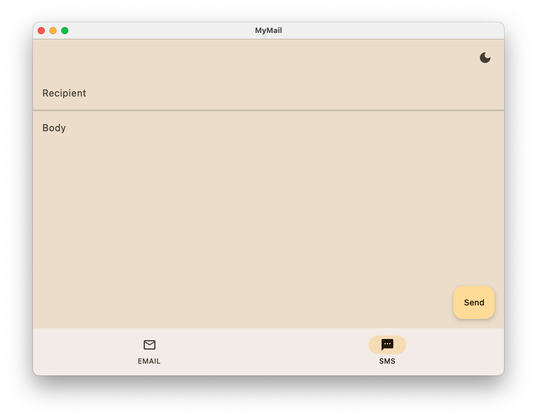
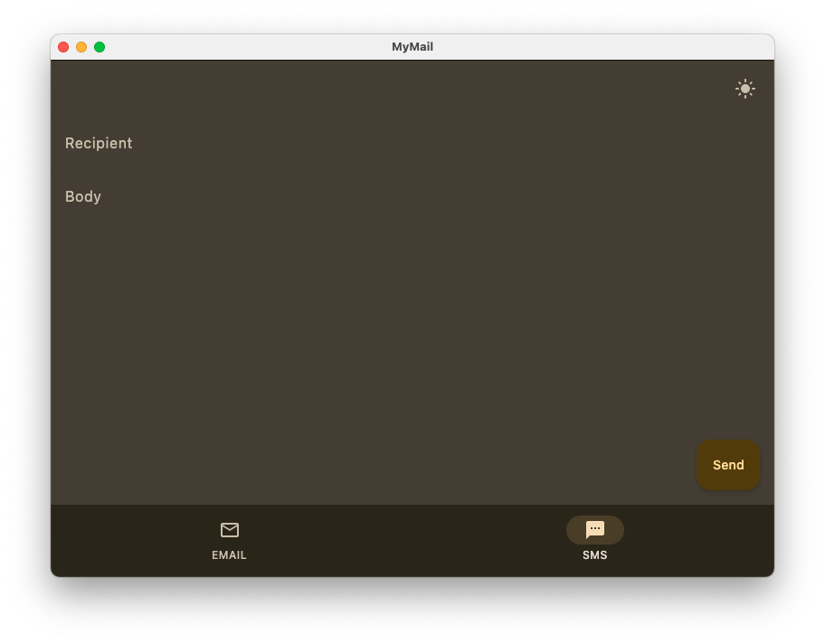

## Web 

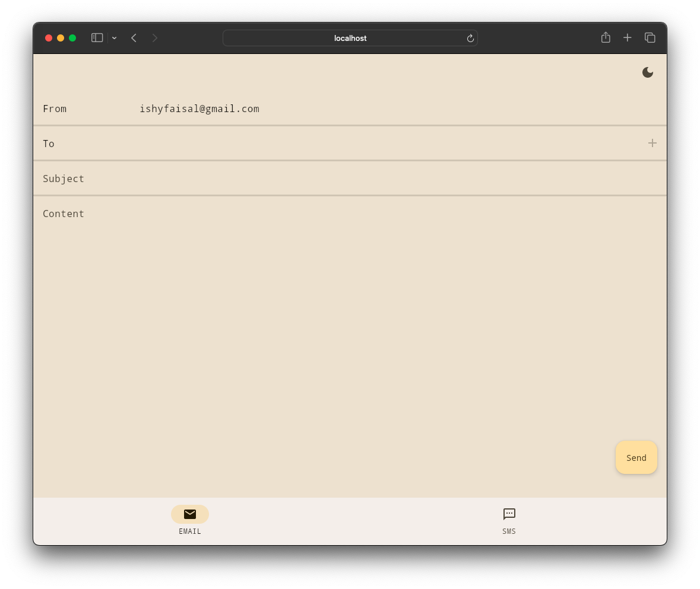
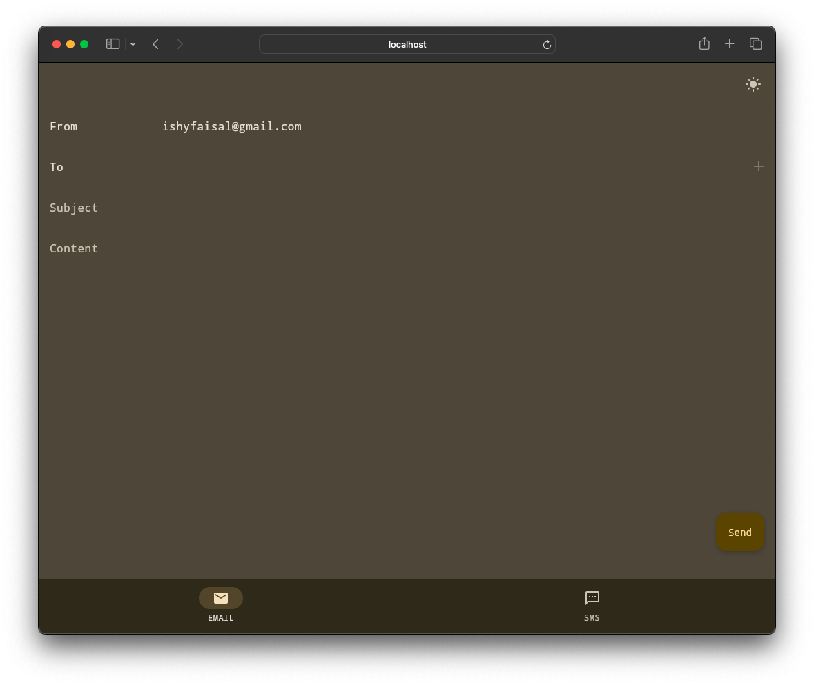
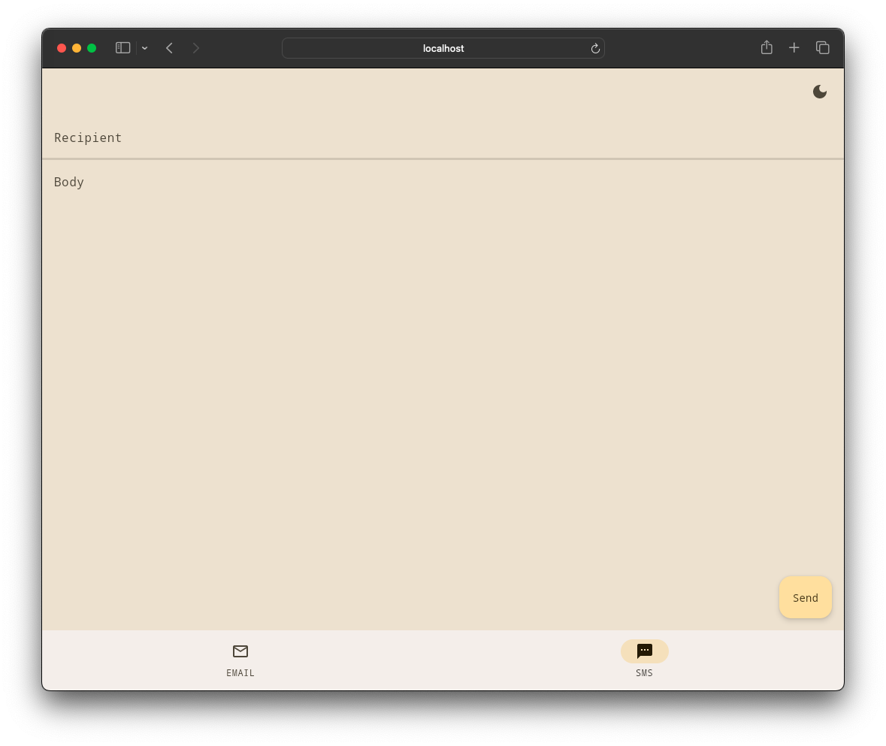
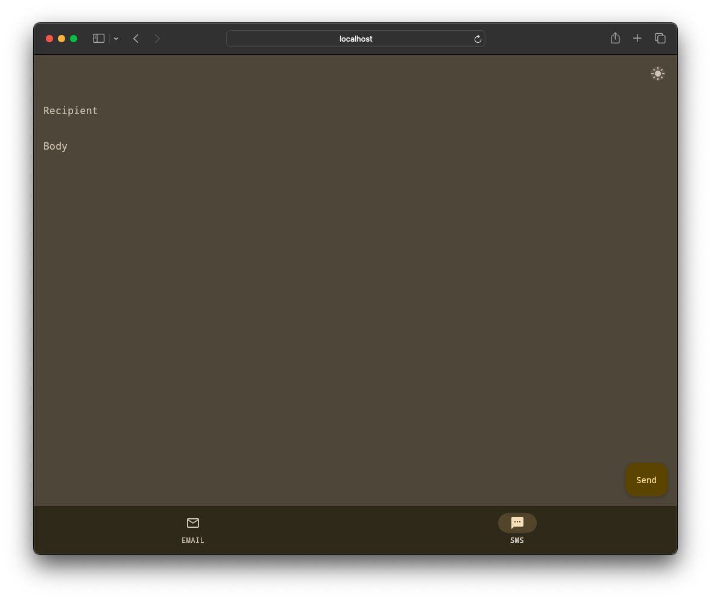

