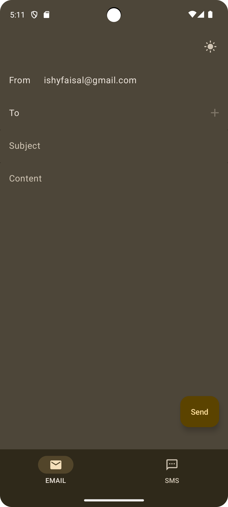

# MyMail

A Kotlin Multiplatform Application for seamless Email and SMS messaging, using the KSend library I built which utilises SendGrid/Twilio API's.

# Platforms 

- Android 
- Ios 
- Desktop
- Web

 height="350px">

## Android 

   

## Ios 

   

## Desktop 

   

## Web 

   

